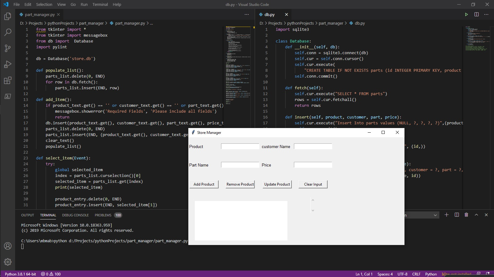

# PartManager
<h2>Sample store manager Desktop App using Python</h2>
<ul>
<li>Window has buttons that do some functions.</li>
    <ul style="list-style-type:none;">
      <li> Add Product.</li>
      <li> Remove Product.</li>
      <li> Update Product.</li>
      <li> Clear Product.</li>
    </ul>
<li>Database (sqlite3)</li>
</ul>

